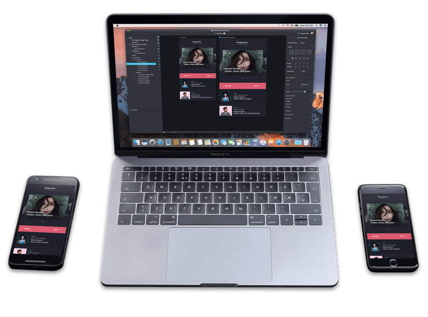

Welcome to the new home for the [Fuse](https://fusetools.com) Open Source
project.

## What is Fuse?

Fuse is a cross-platform mobile app development tool suite, supporting building
Android and iOS applications. 

With Fuse you can build native mobile user interfaces using the easy to learn UX Markup language, and use JavaScript to add business logic.

## How do I get started?

Well, Fuse is available either as an
[installer from the downloads-page](downloads) for end-user, or
[as source code](source-code) for those who wants to
tinker with the internals.

### Using the installer

The installers are pretty straight-forward; download the right installers
for your operating system (currently supported: Windows and macOS), install
it, and open Fuse.
